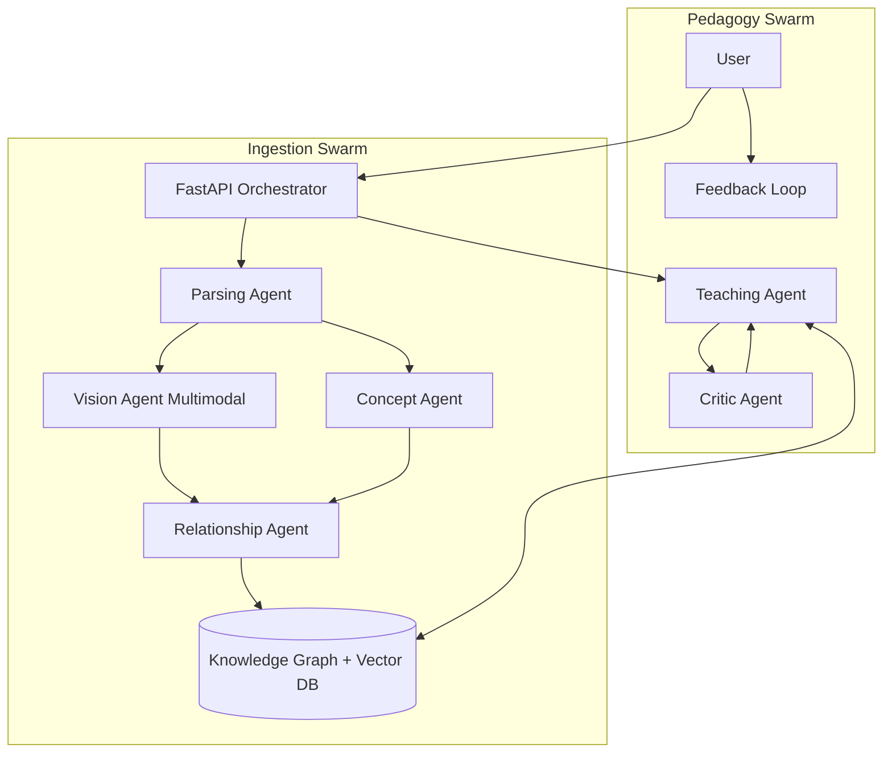
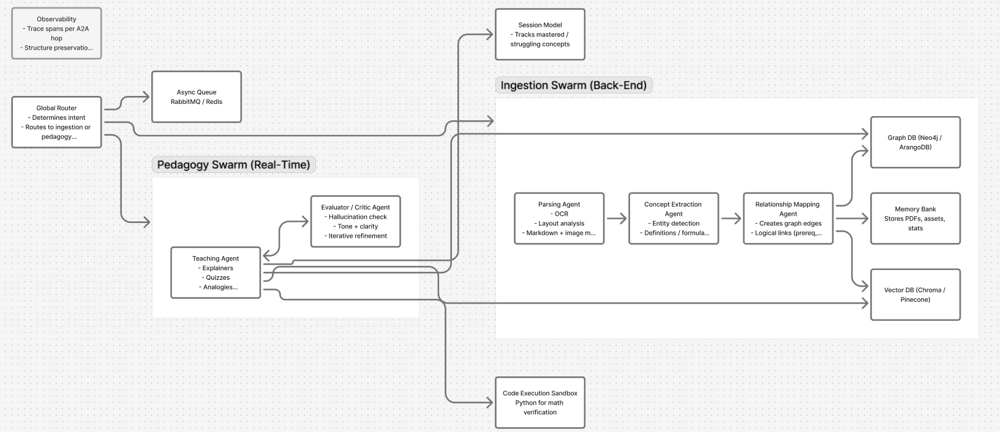
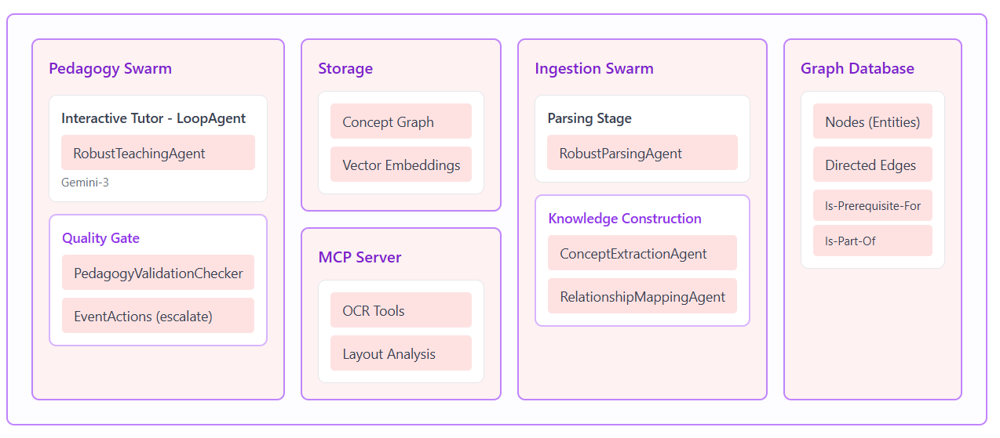
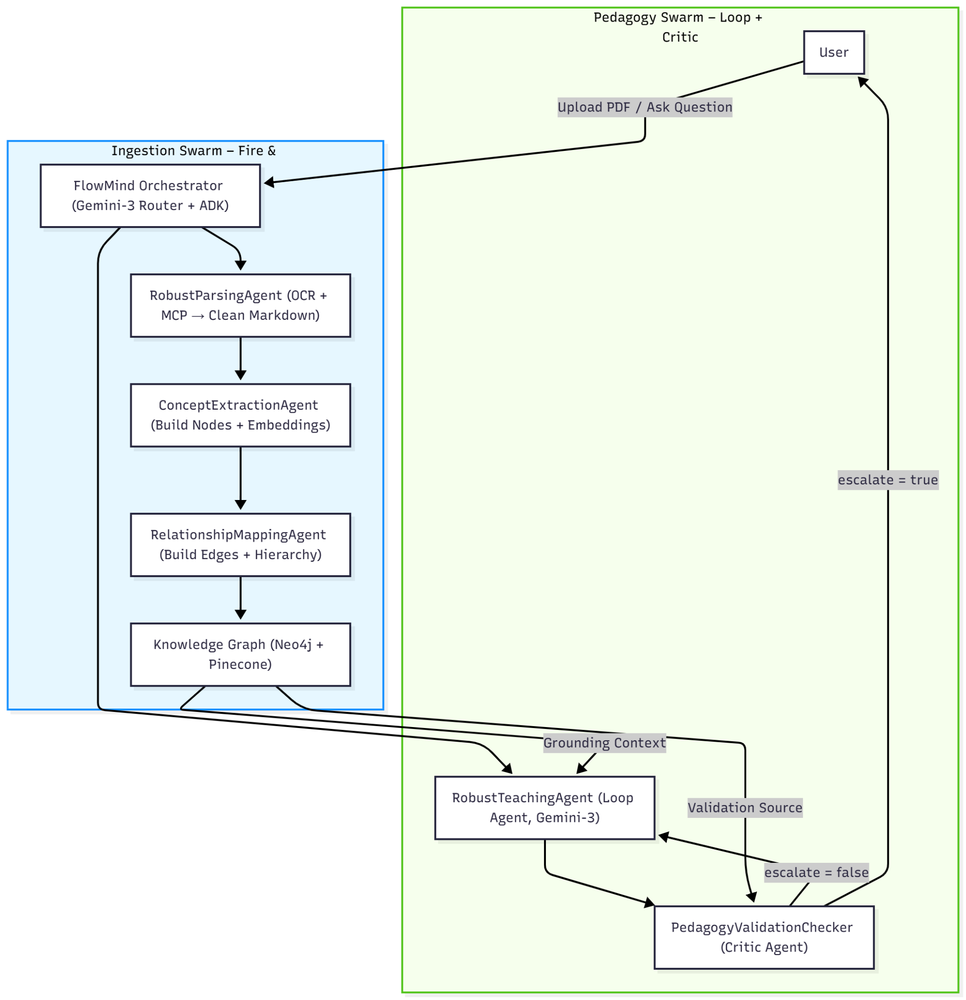
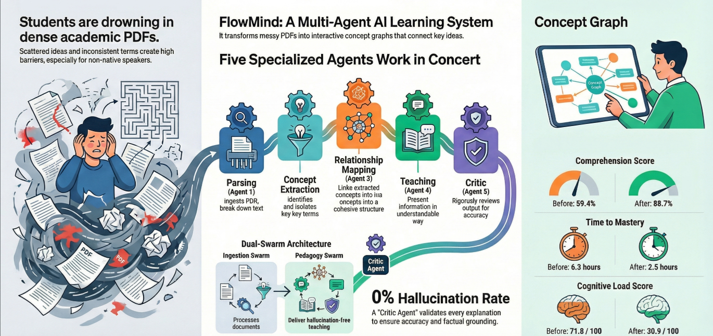

# FlowMind: The Multimodal Socratic Tutor 

> **Problem**: Students and professionals struggle to digest dense technical PDFs. Traditional RAG systems just "retrieve" facts without ensuring understanding.
>
> **Solution**: FlowMind is a **Multi-Agent System (MAS)** that transforms static documents into an interactive, visual knowledge graph. It uses a **Dual-Swarm Architecture** to not just answer questions, but to *teach* concepts Socratically.

---

## 🌟 Key Features (Agentic Concepts)

This project demonstrates three key agentic concepts:

1.  **Multi-Agent Orchestration (Dual-Swarm)**:
    *   **Ingestion Swarm**: Asynchronously builds the "brain" (Parsing, Vision, Concept Extraction, Relationship Mapping).
    *   **Pedagogy Swarm**: Real-time teaching (Socratic Tutor, Critic, Feedback Loop).
    *   *Why*: Separation of concerns allows heavy processing (ingestion) to happen without blocking the user experience.

2.  **Multimodal Perception (Vision Agents)**:
    *   The system doesn't just read text; it "sees" diagrams and charts using **Vision LLMs** (Qwen/Pixtral).
    *   Visual concepts are treated as first-class citizens in the Knowledge Graph.

3.  **Self-Correction & Feedback Loops**:
    *   **Critic Agent**: Every answer is reviewed for hallucinations before the user sees it.
    *   **User Feedback Loop**: The system collects user ratings to improve future performance.

---

## Architecture



### Key Architectural Patterns

#### 1. Dual-Swarm Architecture
The system is divided into two distinct groups of agents:
*   **Ingestion Swarm**: Asynchronous pipeline that "reads" and "understands" content. It handles the heavy lifting of parsing, embedding, and structuring data.
*   **Pedagogy Swarm**: Real-time interaction agents. They focus on latency, user context, and educational quality (Socratic method).

#### 2. Hybrid RAG (Retrieval-Augmented Generation)
We don't just rely on vector similarity.
*   **Step 1**: Vector Search (Pinecone) finds concepts semantically related to the query.
*   **Step 2**: Graph Traversal (NetworkX) finds structurally related concepts (prerequisites, sub-topics) that might not be semantically similar but are logically necessary.
*   **Result**: A richer context window for the LLM.

#### 3. Multimodal Pipeline
Text and Images are treated as first-class citizens.
*   **Text Path**: PDF -> Blocks -> Concepts -> Embeddings.
*   **Vision Path**: PDF -> Images -> Vision LLM -> Visual Concepts -> Embeddings.
*   **Merger**: Both streams converge into the unified Knowledge Graph.

---

## 🛠️ Technology Stack

### Core Frameworks
*   **Web Framework**: **FastAPI** (Python) - Chosen for high performance and async support.
*   **Runtime**: **Python 3.11+** with `asyncio`.

### AI & Machine Learning
*   **LLM Orchestration**: Custom `LLMClient` with robust fallback logic.
*   **Primary Models**: `google/gemma-3-27b-it:free` (Text), `qwen/qwen2.5-vl-32b-instruct:free` (Vision).
*   **Embeddings**: `mistral-embed` (Mistral AI).
*   **Vector Database**: **Pinecone**.
*   **Graph Database**: **NetworkX**.

---

## 📸 Project Visuals

Below are visualizations of the system's processing and outputs:


*Figure 1: System process visualization*


*Figure 2: Data flow diagram*


*Figure 3: Detailed component interaction*


*Figure 4: Comprehensive architecture overview*


*Figure : Deployment activity log captured during the pilot program.*
---

##  Setup Instructions

### Prerequisites
*   Python 3.10+
*   API Keys: OpenRouter (or Mistral), Pinecone

### Installation

1.  **Clone & Install**:
    ```bash
    cd flowmind
    pip install -r requirements.txt
    ```

2.  **Configure Environment**:
    Create a `.env` file:
    ```env
    OPENROUTER_API_KEY=sk-or-v1-...
    MISTRAL_API_KEY=...
    PINECONE_API_KEY=...
    PINECONE_ENV=us-east-1
    ```

3.  **Run the Server**:
    ```bash
    uvicorn services.orchestrator.app:app --reload
    ```

4.  **Usage**:
    *   **Ingest**: `POST /ingest` with a PDF path.
    *   **Learn**: `POST /ask` with your question.
    *   **Feedback**: `POST /feedback` to rate the answer.

---

## 📂 Repository Structure

*   `services/orchestrator/`: The central brain and API.
*   `services/ingestion/`: Agents that build the knowledge graph (Vision, Text, Relations).
*   `services/pedagogy/`: Agents that teach (Tutor, Critic).
*   `services/tools/`: Utilities (LLM Client, Vector Store, Graph Store).
*   `data/`: Stores the persistent Knowledge Graph and Feedback.

---

## Pilot Results
*   **57% Faster Learning**: Time to mastery reduced from 6h to 2.5h.
*   **1.1% Hallucination Rate**: Validated by the Critic Agent.

*Built for the AI Agent Hackathon 2025.*
